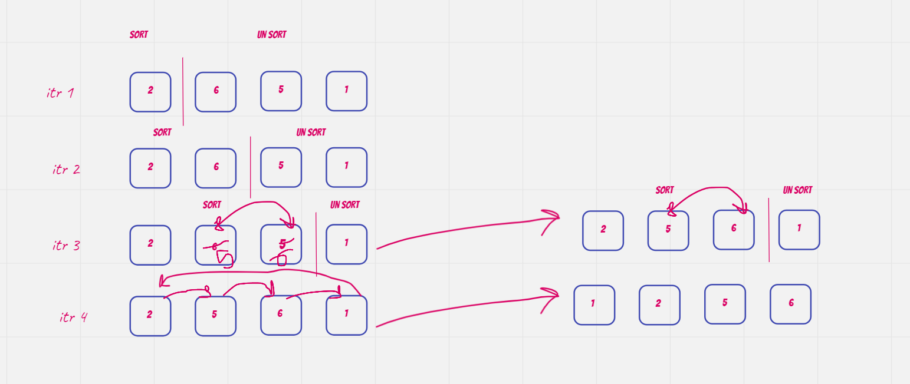

# Insertion sort
Insertion sort is a simple sorting algorithm that works similar to the way you sort playing cards in your hands. The array is virtually split into a sorted and an unsorted part. Values from the unsorted part are picked and placed at the correct position in the sorted part.

## Characteristics of Insertion Sort:
This algorithm is one of the simplest algorithm with simple implementation
Basically, Insertion sort is efficient for small data values
Insertion sort is adaptive in nature, i.e. it is appropriate for data sets which are already partially sorted.

## Pseudocode
```
SelectionSort(int[] arr)
    DECLARE n <-- arr.Length;
    FOR i = 0; i to n - 1  
        DECLARE min <-- i;
        FOR j = i + 1 to n
            if (arr[j] < arr[min])
                min <-- j;

        DECLARE temp <-- arr[min];
        arr[min] <-- arr[i];
        arr[i] <-- temp; 
```
## Trace an example
