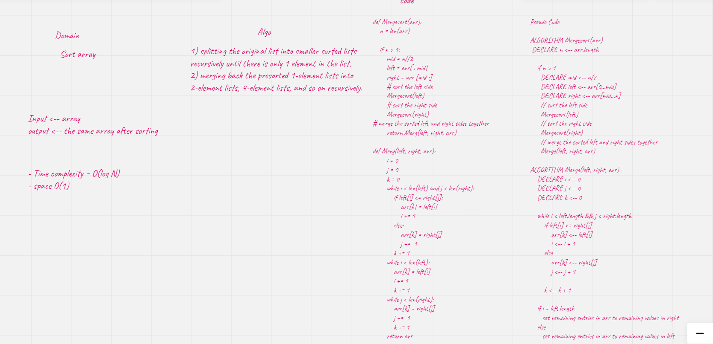
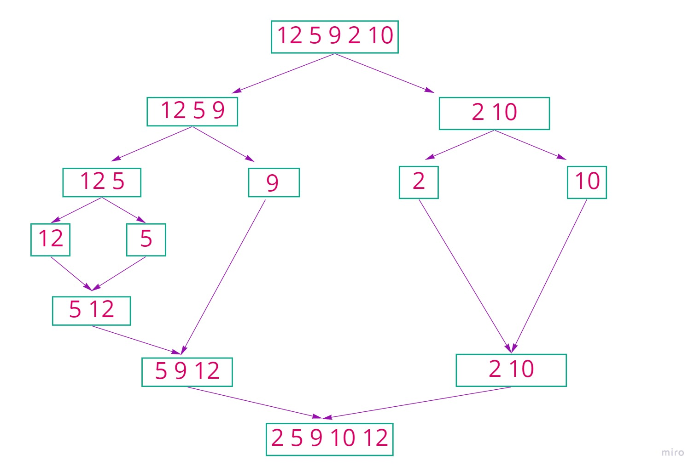

# Challenge Summary
Merge Sort is a Divide and Conquer algorithm. It divides input array in two halves, calls itself for the two halves and then merges the two sorted halves. The merge() function is used for merging two halves. The merge(arr, l, m, r) is key process that assumes that arr[l..m] and arr[m+1..r] are sorted and merges the two sorted sub-arrays into one. 

## Whiteboard Process

## Approach & Efficiency
- Time complexity = O(log N)
- space O(1)

## Solution
- [code](./merge_sort/merg_sort..py)
- [test](./tests/test_merg_sort.py)